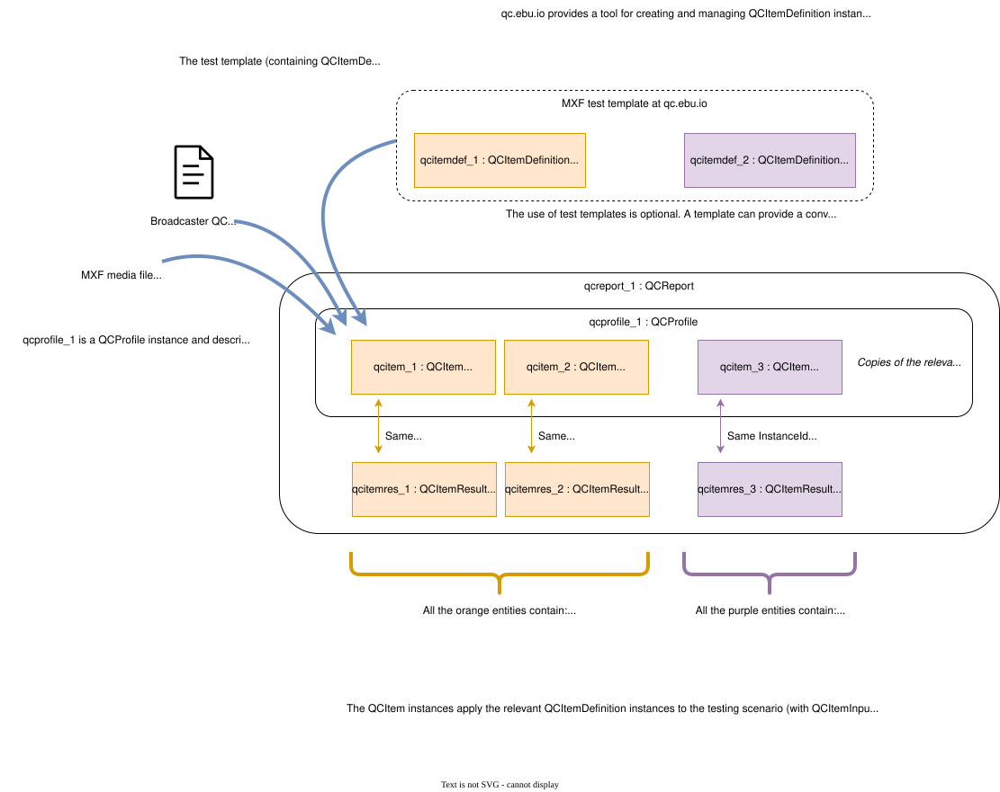

# EBU QC: QC Reports: implementation resources

## About

Resources to help developers implement support for interoperable EBU QC Report XML files (one of the entities defined by the [QC data model](../qc-data-model/))

## Main files

* **QC Report sample**: [qc-report-generic-sample.xml](qc-report-generic-sample.xml)
* **Compliance checklist**: [qc-reports-compliance-checklist.md](qc-reports-compliance-checklist.md)
* **Best practice guidance (Scenario 1)**: [qc-reports-best-practice-guidance-1.md](qc-reports-best-practice-guidance-1.md)
* **QC Report inspector (experimental)**: `qc-report-inspector/`

ℹ️ A [**deployment of the latest QC Report inspector**](https://ebu.github.io/qc/qc-reports/qc-report-inspector/) is available (deployed from the head of the "main" branch)

## EBU QC Report explainer

The diagram below shows an example of constructing an EBU QC Report to capture the details of testing an MXF media file. A QC Report is an instance of the QCReport class in the [QC data model](../qc-data-model/). The QCItemDefinition (another class in the [QC data model](../qc-data-model/)) instances could be obtained from a catalogue using the [QC catalogue API](../qc-catalogue-api/).

